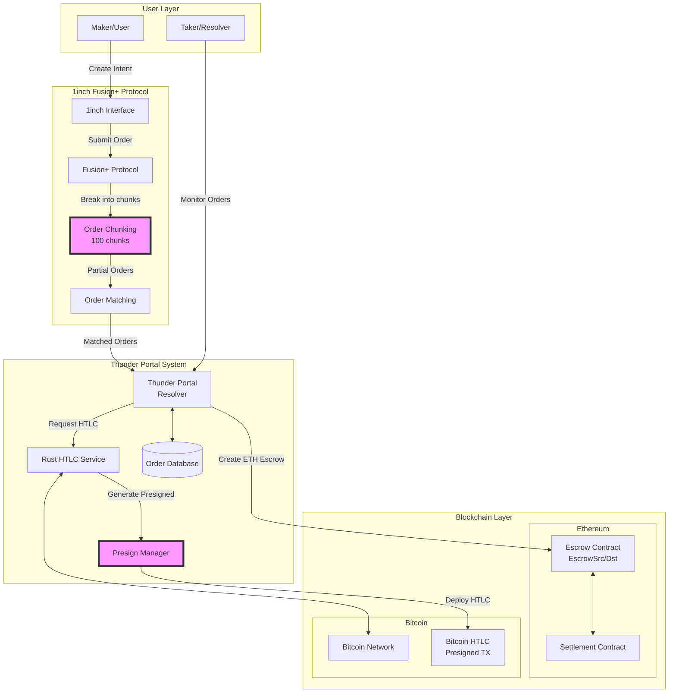
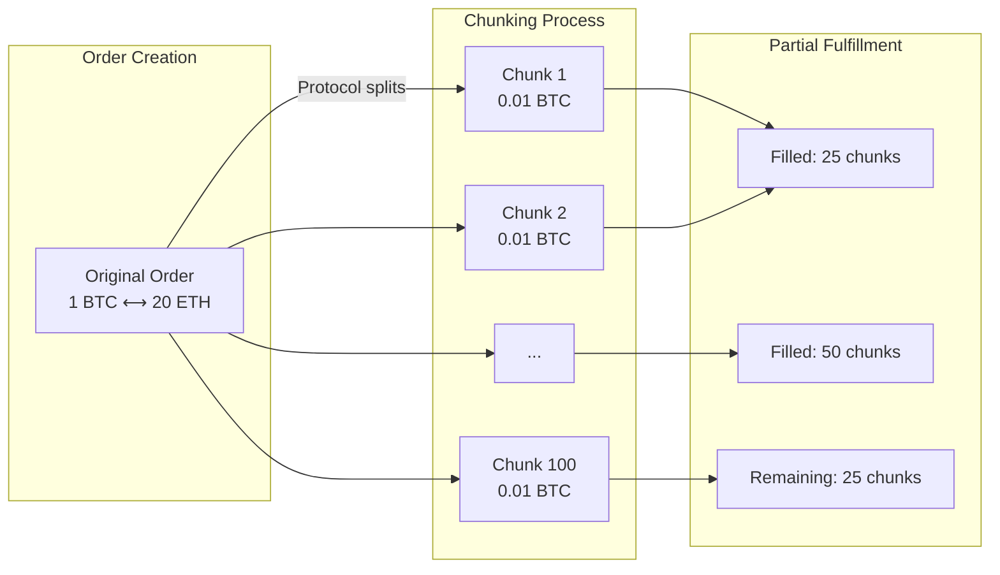
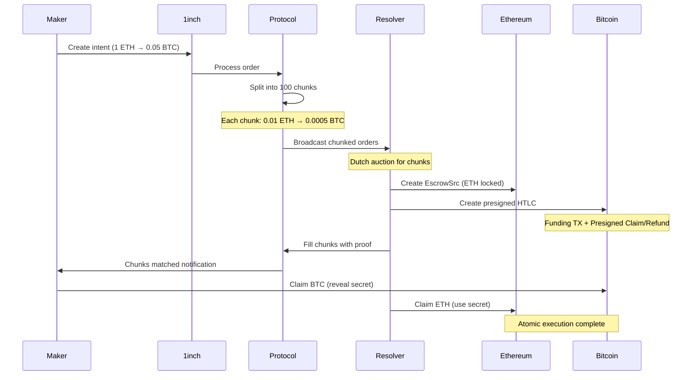
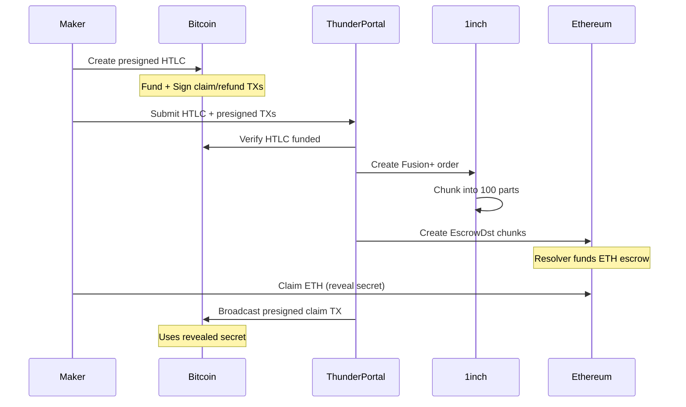
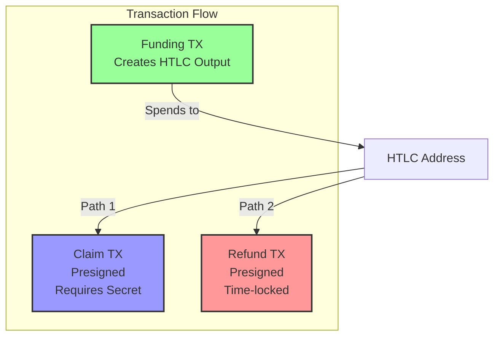
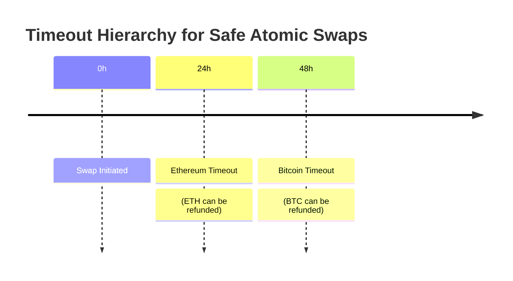
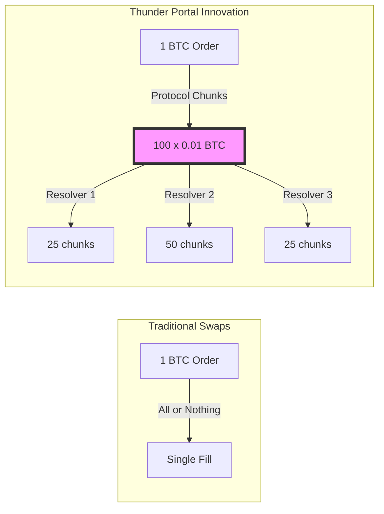

# Thunder Portal - Bitcoin ⚡ Ethereum Atomic Swaps

Thunder Portal enables trustless atomic swaps between Bitcoin and Ethereum through 1inch Fusion+ integration. No bridges, no wrapped tokens, just pure cryptographic security.

## 🚀 What is Thunder Portal?

A complete implementation that extends 1inch Fusion+ to support Bitcoin, enabling:
- **Trustless Swaps**: Direct BTC ⟷ ETH trades without intermediaries
- **No Bridge Risk**: Uses HTLCs instead of wrapped tokens
- **Partial Fulfillment**: Orders split into 100 chunks for better liquidity
- **Dual Escrow System**: Coordinated escrows on both Ethereum and Bitcoin
- **Presigned Transactions**: Bitcoin security model borrowed from Lightning
- **Professional Liquidity**: Resolver network provides competitive rates
- **Gas-Free**: Users pay zero gas fees (resolvers handle everything)

## 🏗️ Architecture

### Complete System Architecture



### Order Flow & Chunking



### Core Components Explained

1. **Order Chunking System**
   - Breaks large orders into 100 equal chunks
   - Enables partial fulfillment by multiple resolvers
   - Each chunk can be independently matched and settled
   - Example: 1 BTC order → 100 chunks of 0.01 BTC each

2. **Dual Escrow System**
   - **Ethereum Side**: Uses 1inch EscrowSrc/EscrowDst contracts
   - **Bitcoin Side**: Creates HTLCs with presigned transactions
   - Both escrows use the same cryptographic hash
   - Atomic execution guaranteed by shared secret

3. **Presigned Transaction Model**
   - Borrowed from Bitcoin Lightning Network concepts
   - Creates refund transactions signed before funding
   - Enables trustless timeout guarantees
   - Key components:
     - Funding transaction (creates HTLC)
     - Claim transaction (presigned, reveals secret)
     - Refund transaction (presigned, time-locked)

4. **Thunder Portal Resolver**
   - Monitors chunked orders from 1inch
   - Manages presigned transaction creation
   - Coordinates dual escrow deployment
   - Handles partial order fulfillment

5. **Rust HTLC Service**
   - Generates Bitcoin scripts and addresses
   - Creates presigned transactions
   - Manages UTXO selection and fee calculation
   - Provides APIs for resolver integration

## 🔄 How It Works

### ETH → BTC Swap (with Chunking & Dual Escrow)



### BTC → ETH Swap (with Presigned Model)



## 🛠️ Technical Details

### Bitcoin HTLC Structure
```bitcoin
IF
    # Claim path (with secret)
    OP_HASH256 <secret_hash> OP_EQUALVERIFY
    OP_DUP OP_HASH160 <recipient_pubkey_hash> OP_EQUALVERIFY
    OP_CHECKSIG
ELSE
    # Refund path (after timeout)
    <timeout> OP_CHECKLOCKTIMEVERIFY OP_DROP
    OP_DUP OP_HASH160 <sender_pubkey_hash> OP_EQUALVERIFY
    OP_CHECKSIG
ENDIF
```

### Presigned Transaction Structure



**Key Properties:**
- **Funding TX**: Broadcast immediately to create HTLC
- **Claim TX**: Presigned but requires secret revelation
- **Refund TX**: Presigned with timelock, ensures maker can recover funds
- **Atomic Safety**: Refund TX protects against resolver misbehavior

### Security Model



- **Timeout Hierarchy**: BTC (48h) > ETH (24h) prevents race conditions
- **Atomic Guarantee**: All-or-nothing execution
- **No Custody**: Users control funds throughout

### API Endpoints
- `POST /v1/orders` - Create swap order
- `POST /v1/htlc/create` - Generate HTLC
- `POST /v1/htlc/verify` - Verify HTLC
- `POST /v1/htlc/{id}/claim` - Claim with preimage
- `GET /v1/health` - Service status

## 🚦 Current Status

### ✅ Implemented
- Complete Rust backend with all endpoints
- Bitcoin HTLC generation and verification
- SQLite database with migrations
- Docker support
- Comprehensive test suite
- Full API documentation

### 🚧 Next Steps
- Live Bitcoin network integration
- Production Fusion+ testing
- Transaction monitoring
- Mainnet deployment

## 🏃 Quick Start

```bash
# Clone repository
git clone https://github.com/your-org/thunder-portal
cd thunder-portal

# Start HTLC service
cd rust-backend
cargo run --release

# In another terminal, start resolver
cd ../typescript-resolver
npm install
npm start
```

### Docker
```bash
docker-compose up -d
```

## 🎯 Key Features

- **No Bridges**: Direct on-chain settlement
- **Professional Market Making**: Resolver competition ensures best rates
- **Gas Abstraction**: Users never pay transaction fees
- **Multi-Language**: TypeScript for business logic, Rust for Bitcoin
- **Production Ready**: Complete implementation with tests

### 💡 Key Innovation: Order Chunking for Partial Fulfillment



**Benefits of Chunking:**
- **Better Liquidity**: Multiple resolvers can fill one order
- **Risk Distribution**: Resolvers can participate with smaller capital
- **Improved Execution**: Partial fills ensure better price discovery
- **User Experience**: Orders execute even with fragmented liquidity

## 🔮 Future Enhancements

- **Lightning Network**: Instant settlements
- **Partial Fills**: Split large orders
- **More Chains**: Extend to other UTXO chains
- **Advanced Routing**: Optimize for best execution

## ❓ Important Clarifications

### How Dual Escrow Works
1. **Same Hash, Two Chains**: Both Ethereum escrow and Bitcoin HTLC use identical hash
2. **Atomic Guarantee**: Revealing secret on one chain enables claim on the other
3. **No Double Spend**: Mathematical impossibility to claim one without enabling the other

### Why Presigned Transactions?
- **Trust Minimization**: Refund guaranteed even if resolver disappears
- **Bitcoin Limitation**: Bitcoin script can't directly interact with Ethereum
- **Lightning Inspiration**: Proven model from Lightning Network

### Order Chunking Details
- **Fixed at 100**: Every order splits into exactly 100 chunks
- **Protocol Level**: Handled by 1inch Fusion+, not Thunder Portal
- **Flexible Fulfillment**: Resolvers can take 1-100 chunks based on liquidity

### Maker vs Resolver Roles
- **Makers**: Create intents, don't need to run infrastructure
- **Resolvers**: Professional market makers who run Thunder Portal
- **Separation**: Makers just sign, resolvers handle all execution

## 🤝 Contributing

We welcome contributions! Please see [CONTRIBUTING.md](CONTRIBUTING.md) for guidelines.

## 📄 License

MIT License - see [LICENSE](LICENSE) for details.

---

**Thunder Portal** - Bringing Bitcoin's $800B to DeFi, trustlessly.