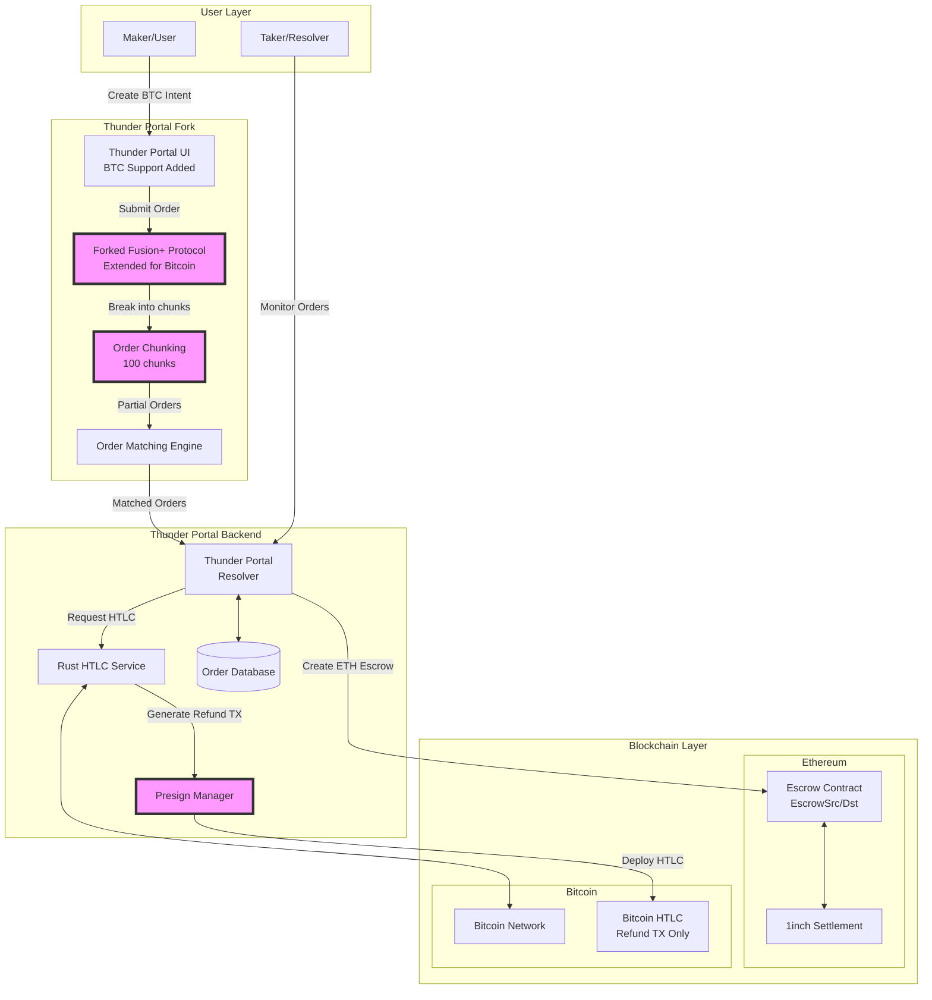
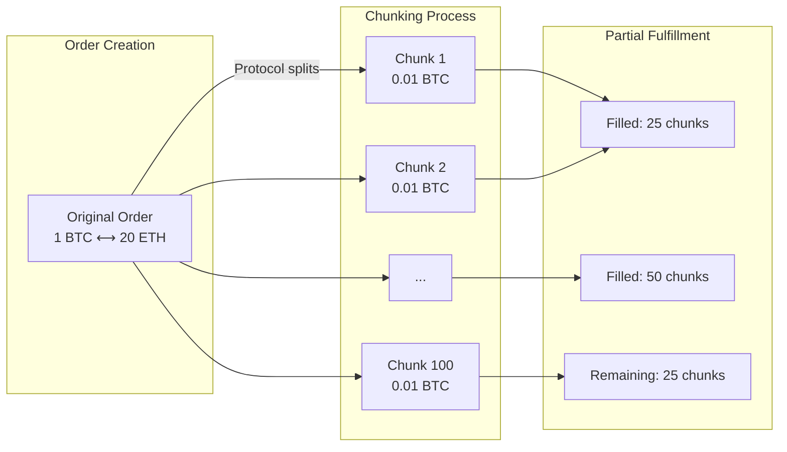
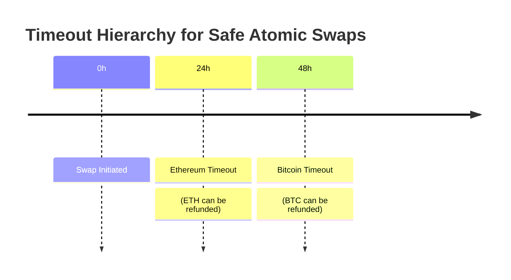
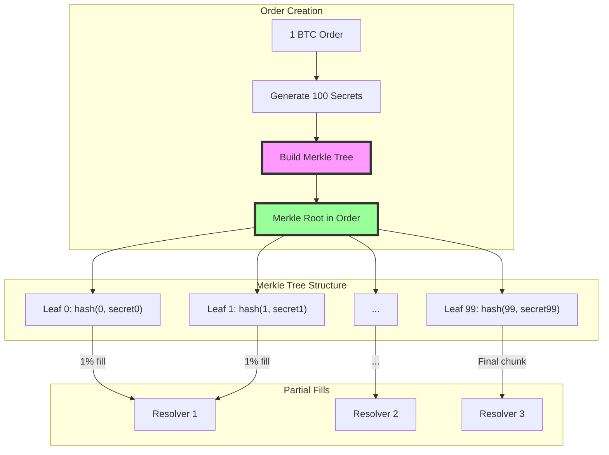

# ⚡ Thunder Portal - Bitcoin ⟷ Ethereum Atomic Swaps

**Hackathon Demo**: Trustless atomic swaps between Bitcoin and Ethereum. No bridges, no wrapped tokens, just cryptographic guarantees.

## 🚀 Quick Start (2 Minutes)

### Prerequisites
- Git
- Node.js 18+
- Rust 1.70+
- Docker (for local blockchain nodes)

### Clone and Setup

```bash
# Clone the repository
git clone https://github.com/NuttakitDW/thunder-portal.git
cd thunder-portal

# Option 1: Interactive Demo (Recommended)
make thunder

# Option 2: Real Testnet Demo (Coming Soon)
make swap-testnet
```

## 🎮 Demo Commands

| Command | Description | Time |
|---------|-------------|------|
| `make thunder` | Beautiful interactive CLI demo with visual atomic swap | 30 sec |
| `make swap-testnet` | Real Bitcoin testnet ⟷ Ethereum Sepolia swap (coming soon) | 60 sec |

### What You'll See with `make thunder`

```
⚡ THUNDER PORTAL - ATOMIC SWAP DEMO
════════════════════════════════════

Creating atomic swap order...
✅ Order created: 0.1 BTC → 2.0 ETH

Chunking order (100 pieces)...
[████████████████████] 100%

Resolvers filling order...
• Resolver 1: 25% (0.025 BTC)
• Resolver 2: 25% (0.025 BTC)
• Resolver 3: 25% (0.025 BTC)
• Resolver 4: 25% (0.025 BTC)

Atomic execution...
✅ Bitcoin HTLC funded
✅ Ethereum escrow funded
✅ Secrets revealed
✅ Atomic swap complete!

Transaction Details:
• Bitcoin TX: abc123...
• Ethereum TX: 0xdef456...
```

## 🏗️ How It Works

1. **Order Creation**: User wants to swap BTC for ETH
2. **Chunking**: Order split into 100 pieces for liquidity
3. **Dual Escrow**: HTLCs created on both chains
4. **Atomic Execution**: Reveal secret to claim both sides
5. **No Trust Required**: Math guarantees fairness

## 🔑 Key Innovation

- **No Bridges**: Direct Bitcoin ⟷ Ethereum swaps
- **No Wrapped Tokens**: Real BTC, real ETH
- **Atomic Guarantee**: All or nothing execution
- **Professional Liquidity**: Resolver network provides competitive rates

## 🎯 Problem We Solve

Current cross-chain bridges have lost **$2.5 billion** to hacks. Thunder Portal eliminates bridge risk by using HTLCs - the same technology securing Bitcoin's Lightning Network.

## 💡 Market Impact

Unlocks **$800 billion** Bitcoin market for DeFi without wrapped tokens or custodial risk.

---

## 📊 Technical Architecture

### Complete System Architecture



### Order Flow & Chunking



### ETH → BTC Swap Flow


### Security Model - Timeout Hierarchy



### Bitcoin HTLC Structure

```bitcoin
IF
    # Claim path (with secret)
    OP_HASH256 <secret_hash> OP_EQUALVERIFY
    OP_DUP OP_HASH160 <recipient_pubkey_hash> OP_EQUALVERIFY
    OP_CHECKSIG
ELSE
    # Refund path (after timeout)
    <timeout> OP_CHECKLOCKTIMEVERIFY OP_DROP
    OP_DUP OP_HASH160 <sender_pubkey_hash> OP_EQUALVERIFY
    OP_CHECKSIG
ENDIF
```

### Merkle Tree-Based Partial Fulfillment



---

**Thunder Portal** - Trustless Bitcoin DeFi is Here ⚡