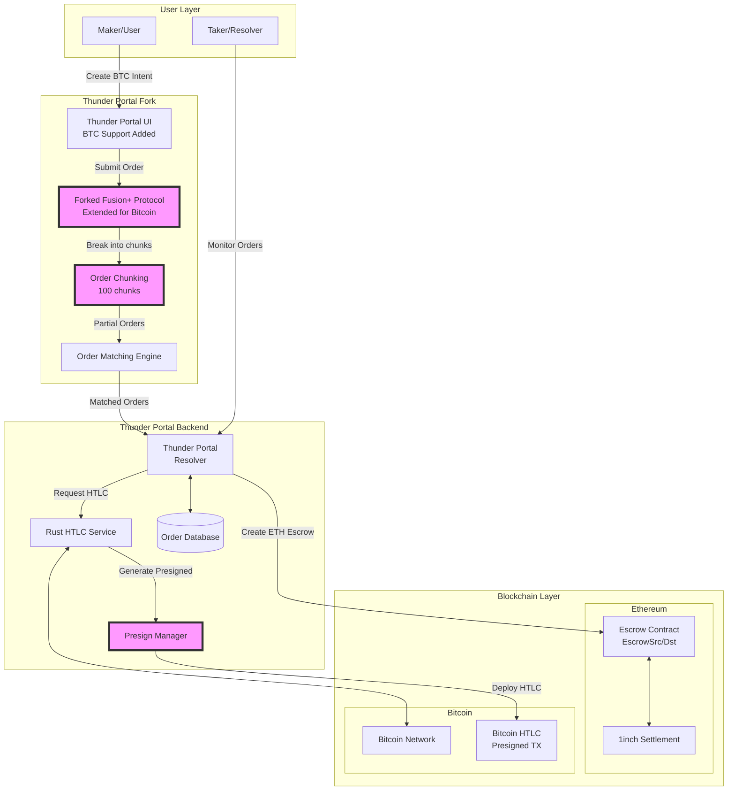
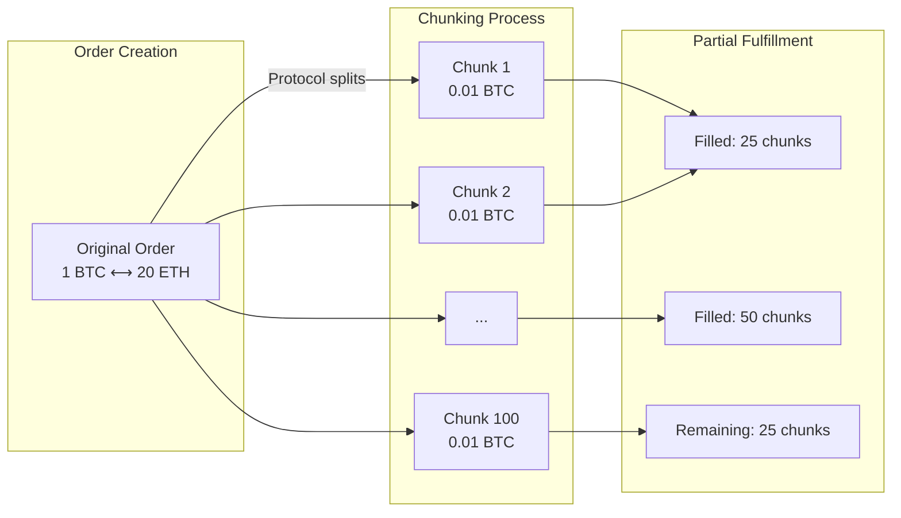
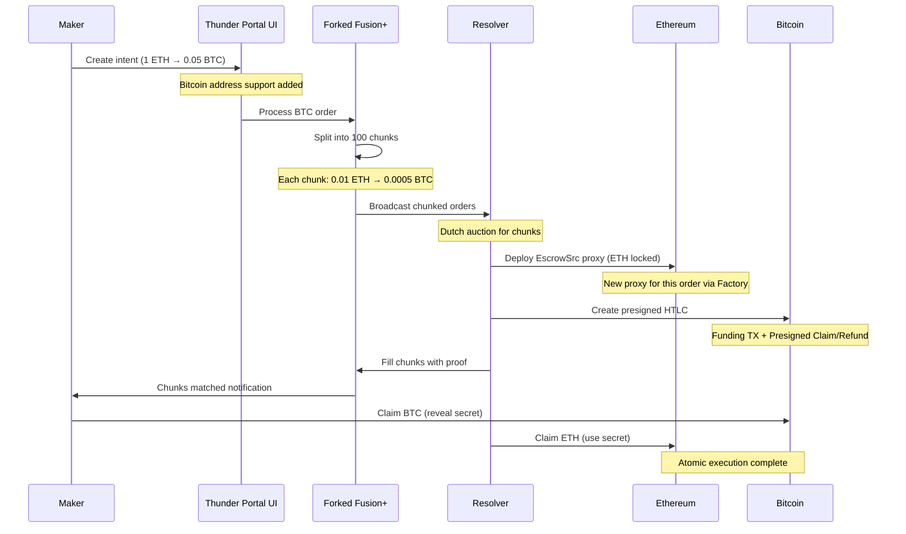
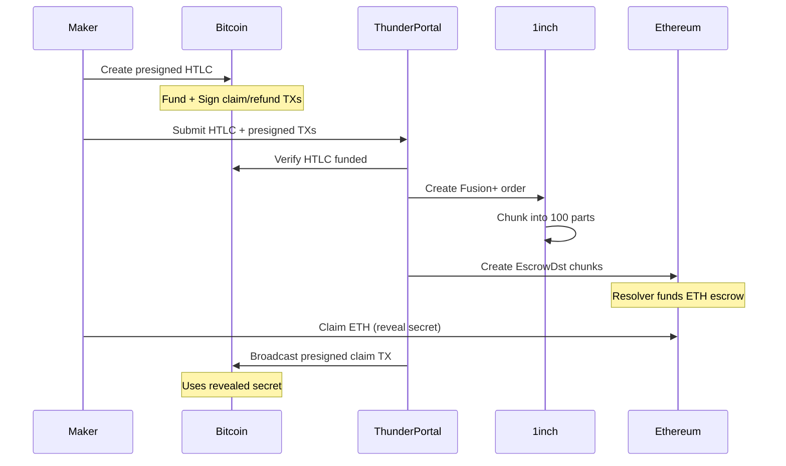
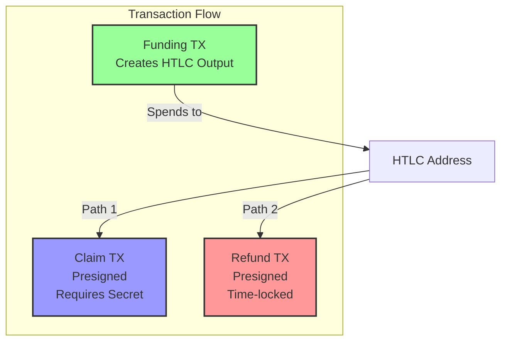
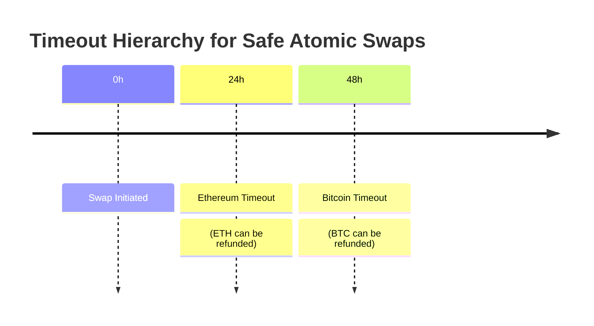

# Thunder Portal - Bitcoin ⚡ Ethereum Atomic Swaps

Thunder Portal enables trustless atomic swaps between Bitcoin and Ethereum through 1inch Fusion+ integration. No bridges, no wrapped tokens, just pure cryptographic security.

## 🚀 What is Thunder Portal?

A complete implementation that extends 1inch Fusion+ to support Bitcoin, enabling:
- **Trustless Swaps**: Direct BTC ⟷ ETH trades without intermediaries
- **No Bridge Risk**: Uses HTLCs instead of wrapped tokens
- **Partial Fulfillment**: Orders split into 100 chunks for better liquidity
- **Dual Escrow System**: Coordinated escrows on both Ethereum and Bitcoin
- **Presigned Transactions**: Bitcoin security model borrowed from Lightning
- **Professional Liquidity**: Resolver network provides competitive rates
- **Gas-Free**: Users pay zero gas fees (resolvers handle everything)

## 🏗️ Architecture

### Complete System Architecture



### Order Flow & Chunking



### Core Components Explained

1. **Forked 1inch Fusion+ Protocol**
   - **Why Fork?**: Current Fusion+ doesn't support Bitcoin orders
   - **Key Extensions**:
     - Added Bitcoin as supported asset type
     - Extended order structure for BTC addresses
     - Modified matching engine for cross-chain orders
     - Integrated HTLC verification requirements

2. **Order Chunking System with Merkle Trees**
   - Breaks large orders into 100 equal chunks
   - Enables partial fulfillment by multiple resolvers
   - Each chunk can be independently matched and settled
   - Example: 1 BTC order → 100 chunks of 0.01 BTC each
   
   **Merkle Tree Implementation**:
   - **101 Secrets Generated**: For 100 chunks, 101 secrets are created
     - Secrets 0-99: For partial fills (1% each)
     - Secret 100: Special secret for complete fill (100% at once)
   - **Merkle Leaves**: Each leaf = `keccak256(index, hashedSecret)`
   - **Merkle Root**: Embedded in order's `hashlockInfo` field
   - **Progressive Filling**: Secrets must be revealed in order based on fill percentage
   - **No Reuse**: Each secret can only be used once via `MerkleStorageInvalidator`

3. **Dual Escrow System**
   - **Ethereum Side**: Deploys ONE EscrowSrc/EscrowDst proxy per order
     - Single escrow manages all 100 chunks
     - Merkle root stored in escrow validates each partial fill
   - **Bitcoin Side**: Creates HTLCs with presigned transactions
   - Both escrows use the same cryptographic hash (merkle root)
   - Atomic execution guaranteed by shared secret
   - **Per-Order Isolation**: Each swap gets dedicated escrow contracts

4. **Presigned Transaction Model**
   - Borrowed from Bitcoin Lightning Network concepts
   - Creates refund transactions signed before funding
   - Enables trustless timeout guarantees
   - Key components:
     - Funding transaction (creates HTLC)
     - Claim transaction (presigned, reveals secret)
     - Refund transaction (presigned, time-locked)

5. **Thunder Portal Resolver**
   - Monitors chunked orders from forked protocol
   - Manages presigned transaction creation
   - Coordinates dual escrow deployment
   - Handles partial order fulfillment

6. **Rust HTLC Service**
   - Generates Bitcoin scripts and addresses
   - Creates presigned transactions
   - Manages UTXO selection and fee calculation
   - Provides APIs for resolver integration

## 🔄 How It Works

### ETH → BTC Swap (with Forked Protocol)



### BTC → ETH Swap (with Presigned Model)



## 🛠️ Technical Details

### Bitcoin HTLC Structure
```bitcoin
IF
    # Claim path (with secret)
    OP_HASH256 <secret_hash> OP_EQUALVERIFY
    OP_DUP OP_HASH160 <recipient_pubkey_hash> OP_EQUALVERIFY
    OP_CHECKSIG
ELSE
    # Refund path (after timeout)
    <timeout> OP_CHECKLOCKTIMEVERIFY OP_DROP
    OP_DUP OP_HASH160 <sender_pubkey_hash> OP_EQUALVERIFY
    OP_CHECKSIG
ENDIF
```

### Presigned Transaction Structure



**Key Properties:**
- **Funding TX**: Broadcast immediately to create HTLC
- **Claim TX**: Presigned but requires secret revelation
- **Refund TX**: Presigned with timelock, ensures maker can recover funds
- **Atomic Safety**: Refund TX protects against resolver misbehavior

### Security Model



- **Timeout Hierarchy**: BTC (48h) > ETH (24h) prevents race conditions
- **Atomic Guarantee**: All-or-nothing execution
- **No Custody**: Users control funds throughout

### API Endpoints
- `POST /v1/orders` - Create swap order
- `POST /v1/htlc/create` - Generate HTLC
- `POST /v1/htlc/verify` - Verify HTLC
- `POST /v1/htlc/{id}/claim` - Claim with preimage
- `GET /v1/health` - Service status

## 🚦 Current Status

### ✅ Implemented
- Complete Rust backend with all endpoints
- Bitcoin HTLC generation and verification
- SQLite database with migrations
- Docker support
- Comprehensive test suite
- Full API documentation

### 🔧 Fork Requirements
To support Bitcoin in 1inch Fusion+, we need to:

1. **Protocol Extensions**
   - Add `BTC` as valid asset type
   - Extend order structure with Bitcoin address fields
   - Add HTLC hash field to order metadata
   - Modify validation to accept Bitcoin addresses

2. **UI Modifications**
   - Add Bitcoin wallet connection
   - Support Bitcoin address input/validation
   - Display BTC balances and rates
   - Show HTLC status tracking

3. **Matching Engine Updates**
   - Recognize cross-chain order pairs
   - Validate HTLC requirements
   - Track presigned transaction status
   - Handle longer settlement times

### 🚧 Next Steps
- Fork and extend 1inch Fusion+ protocol
- Implement Bitcoin support in UI
- Live Bitcoin network integration
- Production testing with forked protocol
- Mainnet deployment

## 🏃 Quick Start

```bash
# Clone repository
git clone https://github.com/your-org/thunder-portal
cd thunder-portal

# Start HTLC service
cd rust-backend
cargo run --release

# In another terminal, start resolver
cd ../typescript-resolver
npm install
npm start
```

### Docker
```bash
docker-compose up -d
```

## 🎯 Key Features

- **No Bridges**: Direct on-chain settlement
- **Professional Market Making**: Resolver competition ensures best rates
- **Gas Abstraction**: Users never pay transaction fees
- **Multi-Language**: TypeScript for business logic, Rust for Bitcoin
- **Production Ready**: Complete implementation with tests

### 💡 Key Innovation: Merkle Tree-Based Partial Fulfillment

```mermaid
graph TB
    subgraph "Order Creation"
        O[1 BTC Order] --> S[Generate 101 Secrets]
        S --> MT[Build Merkle Tree]
        MT --> MR[Merkle Root in Order]
    end
    
    subgraph "Merkle Tree Structure"
        MR --> L1[Leaf 0: hash(0, secret0)]
        MR --> L2[Leaf 1: hash(1, secret1)]
        MR --> L3[...]
        MR --> L100[Leaf 100: hash(100, secret100)]
    end
    
    subgraph "Partial Fills"
        L1 -->|1% fill| R1[Resolver 1]
        L2 -->|1% fill| R1
        L3 -->|...| R2[Resolver 2]
        L100 -->|Final chunk| R3[Resolver 3]
    end
    
    style MT fill:#f9f,stroke:#333,stroke-width:4px
    style MR fill:#9f9,stroke:#333,stroke-width:4px
```

**How Merkle Trees Enable Chunking:**

1. **Secret Generation**:
   ```solidity
   // For 100 chunks, generate 101 secrets
   bytes32[] secrets = new bytes32[](101);
   for (uint i = 0; i < 101; i++) {
       secrets[i] = keccak256(randomBytes);
   }
   ```

2. **Merkle Tree Construction**:
   ```solidity
   // Create merkle leaves
   bytes32[] leaves = new bytes32[](101);
   for (uint i = 0; i < 101; i++) {
       leaves[i] = keccak256(abi.encodePacked(i, hash(secrets[i])));
   }
   // Build tree and get root
   bytes32 merkleRoot = buildMerkleTree(leaves);
   ```

3. **Progressive Revelation**:
   - Resolver filling 1-25%: Must reveal secrets 0-24
   - Resolver filling 26-50%: Must reveal secrets 25-49
   - Resolver filling 100% at once: Uses secret 100 (special complete fill)
   - Each secret can only be used once
   - MerkleStorageInvalidator tracks used indices

4. **Security Properties**:
   - **Atomic per Chunk**: Each 1% chunk is atomic
   - **No Front-Running**: Secrets must match merkle proof
   - **Progressive Execution**: Can't skip ahead in sequence
   - **Double-Spend Prevention**: Each index used only once

**Benefits of Merkle-Based Chunking:**
- **Cryptographic Security**: Verifiable partial execution
- **Capital Efficiency**: Resolvers can fill exact amounts
- **Parallel Execution**: Multiple resolvers simultaneously
- **Gas Optimization**: Only verify used branches

## 🔮 Future Enhancements

- **Lightning Network**: Instant settlements
- **Partial Fills**: Split large orders
- **More Chains**: Extend to other UTXO chains
- **Advanced Routing**: Optimize for best execution

## ❓ Important Clarifications

### How Dual Escrow Works
1. **Same Hash, Two Chains**: Both Ethereum escrow and Bitcoin HTLC use identical hash
2. **Atomic Guarantee**: Revealing secret on one chain enables claim on the other
3. **No Double Spend**: Mathematical impossibility to claim one without enabling the other

### Escrow Contract Deployment
- **One Escrow Per Order**: A single escrow handles all 100 chunks via merkle tree
- **Not Reused**: Each order deploys new escrow proxy contracts
- **Gas Efficient**: Uses OpenZeppelin Clones (minimal proxy pattern)
- **Chunk Management**: Merkle tree in escrow validates each partial fill
- **Deterministic Addresses**: CREATE2 ensures predictable contract addresses
- **Implementation Pattern**: Shared logic contract, unique proxy per order
- **Security**: Complete isolation between different swaps

### Why Presigned Transactions?
- **Trust Minimization**: Refund guaranteed even if resolver disappears
- **Bitcoin Limitation**: Bitcoin script can't directly interact with Ethereum
- **Lightning Inspiration**: Proven model from Lightning Network

### Why Fork 1inch Fusion+?
- **No Native Bitcoin Support**: Current protocol only handles EVM chains
- **Address Format**: Bitcoin addresses need special handling
- **Settlement Time**: Bitcoin's longer confirmation times need accommodation
- **HTLC Integration**: Protocol must understand cross-chain atomic swaps

### Order Chunking & Merkle Tree Details
- **Fixed at 100**: Every order splits into exactly 100 chunks
- **101 Secrets**: 
  - Secrets 0-99: For partial fills (1% increments)
  - Secret 100: Special secret for complete fill (100% at once)
- **Merkle Root**: Embedded in order, verifies all partial fills
- **Progressive Indices**: Secrets revealed based on cumulative fill %
- **Complete Fill Optimization**: Resolver can use secret 100 to fill entire order
- **Protocol Level**: Handled by forked Fusion+ protocol
- **Flexible Fulfillment**: Resolvers can take 1-100 chunks or complete fill
- **Index Calculation**: 
  - Partial: `idx = 100 * (cumulativeFill - 1) / totalAmount`
  - Complete: `idx = 100` (uses special secret)
- **Security**: MerkleStorageInvalidator prevents secret reuse

### Maker vs Resolver Roles
- **Makers**: Create intents, don't need to run infrastructure
- **Resolvers**: Professional market makers who run Thunder Portal
- **Separation**: Makers just sign, resolvers handle all execution

## 🤝 Contributing

We welcome contributions! Please see [CONTRIBUTING.md](CONTRIBUTING.md) for guidelines.

## 📄 License

MIT License - see [LICENSE](LICENSE) for details.

---

**Thunder Portal** - Bringing Bitcoin's $800B to DeFi, trustlessly.