# ⚡ Thunder Portal - Bitcoin ⟷ Ethereum Atomic Swaps

**Hackathon Demo**: Trustless atomic swaps between Bitcoin and Ethereum. No bridges, no wrapped tokens, just cryptographic guarantees.

## 🚀 Quick Start (2 Minutes)

### Prerequisites
- Git
- Node.js 18+
- Rust 1.70+ (for Bitcoin HTLC service)
- Docker (only for `make thunder` demo)

### Clone and Setup

```bash
# Clone the repository
git clone https://github.com/NuttakitDW/thunder-portal.git
cd thunder-portal

# Install dependencies
make setup
```

### Option 1: Interactive Demo (Fastest)
```bash
make thunder
```

### Option 2: Real Testnet Swap
```bash
# 1. Configure environment (one-time setup)
cp .env.testnet.example .env.testnet
# Edit .env.testnet to add private keys or use provided test wallets

# 2. Start HTLC service (optional but recommended)
make htlc-start

# 3. Run the swap
make swap-testnet
```

## 🎮 Demo Commands

| Command | Description | Time |
|---------|-------------|------|
| `make thunder` | Beautiful interactive CLI demo with visual atomic swap | 30 sec |
| `make swap-testnet` | Real Bitcoin testnet3 ⟷ Ethereum Sepolia swap with on-chain transactions | 2-3 min |

### What You'll See with `make thunder`

```
⚡ THUNDER PORTAL - ATOMIC SWAP DEMO
════════════════════════════════════

Creating atomic swap order...
✅ Order created: 0.1 BTC → 2.0 ETH

Chunking order (100 pieces)...
[████████████████████] 100%

Resolvers filling order...
• Resolver 1: 25% (0.025 BTC)
• Resolver 2: 25% (0.025 BTC)
• Resolver 3: 25% (0.025 BTC)
• Resolver 4: 25% (0.025 BTC)

Atomic execution...
✅ Bitcoin HTLC funded
✅ Ethereum escrow funded
✅ Secrets revealed
✅ Atomic swap complete!

Transaction Details:
• Bitcoin TX: abc123...
• Ethereum TX: 0xdef456...
```

## 🌐 Real Testnet Swap Guide

### Prerequisites for `make swap-testnet`

1. **Environment Setup**
   ```bash
   # Install dependencies
   make setup
   
   # Copy environment template
   cp .env.testnet.example .env.testnet
   ```

2. **Configure Private Keys**
   - Add your testnet private keys to `.env.testnet`
   - Or use the provided test wallets in `doc/testnet-wallets/wallets-sensitive.json`

3. **Get Testnet Funds**
   - **Bitcoin testnet3**: https://coinfaucet.eu/en/btc-testnet/
   - **Ethereum Sepolia**: https://sepoliafaucet.com/
   - Minimum: 0.001 BTC and 0.01 ETH

### Running the Testnet Swap

```bash
# Step 1: Start Bitcoin HTLC service (optional but recommended)
make htlc-start

# Step 2: Run the testnet swap
make swap-testnet
```

### What Happens

1. **Balance Check**: Verifies you have sufficient testnet funds
2. **Bitcoin HTLC**: Creates HTLC address for atomic swap
3. **Ethereum Escrow**: Deploys and funds escrow contract on Sepolia
4. **Swap Details**: Saves to `deployments/active-swap.json`

### Example Output

```
⚡ Thunder Portal - Real Testnet Atomic Swap
════════════════════════════════════════════

💰 Checking balances...
Bitcoin Maker: 0.00157925 BTC
Ethereum Resolver: 3.995 ETH

🔧 Creating atomic swap...
Swap: 0.0001 BTC ⟷ 0.001 ETH

📘 Creating Ethereum Escrow...
✅ Escrow created at: 0xB690C75F122237A012fbaDF650d6870CD00cfe55
✅ Escrow funded with 0.001 ETH

📋 Swap Status:
1. ✅ Bitcoin HTLC created
2. ⏳ Waiting for Bitcoin HTLC funding
3. ✅ Ethereum escrow created and funded
```

### Verify Transactions

- **Ethereum Escrow**: Check the contract on [Sepolia Etherscan](https://sepolia.etherscan.io)
- **Bitcoin HTLC**: View on [Blockstream Testnet Explorer](https://blockstream.info/testnet)

### Troubleshooting

| Issue | Solution |
|-------|----------|
| "HTLC API not running" | Run `make htlc-start` in another terminal |
| "Missing private keys" | Check `.env.testnet` has all required keys |
| "Insufficient balance" | Get testnet funds from faucets above |
| "Network timeout" | Check internet connection, try again |
| "Contract deployment failed" | Ensure you have enough ETH for gas |
| Other issues | See [docs/TESTNET-TROUBLESHOOTING.md](docs/TESTNET-TROUBLESHOOTING.md) |

### Complete the Swap

After funding the Bitcoin HTLC:
```bash
# Coming soon: Claim functionality
make swap-claim
```

## 🏗️ How It Works

1. **Order Creation**: User wants to swap BTC for ETH
2. **Chunking**: Order split into 100 pieces for liquidity
3. **Dual Escrow**: HTLCs created on both chains
4. **Atomic Execution**: Reveal secret to claim both sides
5. **No Trust Required**: Math guarantees fairness

## 🔗 1inch Fusion+ Integration

Thunder Portal extends the 1inch Fusion+ protocol to support native Bitcoin atomic swaps. Here's where we integrate:

### Code Integration Points

1. **Protocol Extension** ([README.md:3](https://github.com/NuttakitDW/thunder-portal/blob/master/README.md#L3))
   - Extends 1inch Fusion+ to support Bitcoin through custom HTLC service

2. **Limit Order Protocol Interface** ([contracts/LimitOrderProtocol.sol:6-8](https://github.com/NuttakitDW/thunder-portal/blob/master/contracts/LimitOrderProtocol.sol#L6-L8))
   ```solidity
   // Simplified interface to 1inch Limit Order Protocol
   // Enables atomic swaps using 1inch's limit order infrastructure
   ```

3. **Resolver Integration** ([resolver/execute-real-swap-with-lop.js:69-87](https://github.com/NuttakitDW/thunder-portal/blob/master/resolver/execute-real-swap-with-lop.js#L69-L87))
   ```javascript
   // Registers swap with 1inch Limit Order Protocol
   // Handles order matching and execution flow
   ```

4. **Cross-Chain Order Structure** ([evm-resolver/contracts/src/CrossChainOrder.sol:1-50](https://github.com/NuttakitDW/thunder-portal/blob/master/evm-resolver/contracts/src/CrossChainOrder.sol#L1-L50))
   ```solidity
   // Implements Fusion+ compatible order structure
   // Adds Bitcoin HTLC support to standard order format
   ```

### Key Extensions

- **Bitcoin HTLC Support**: Added native Bitcoin script generation to Fusion+ resolver pattern
- **Cross-Chain Atomicity**: Extended order validation to ensure both Bitcoin and Ethereum sides execute atomically
- **Order Chunking**: Leveraged Fusion+ liquidity aggregation for better price discovery

The integration allows Bitcoin to work seamlessly within the 1inch ecosystem while maintaining the security guarantees of atomic swaps

## 🔑 Key Innovation

- **No Bridges**: Direct Bitcoin ⟷ Ethereum swaps
- **No Wrapped Tokens**: Real BTC, real ETH
- **Atomic Guarantee**: All or nothing execution
- **Professional Liquidity**: Resolver network provides competitive rates

## 🎯 Problem We Solve

Current cross-chain bridges have lost **$2.5 billion** to hacks. Thunder Portal eliminates bridge risk by using HTLCs - the same technology securing Bitcoin's Lightning Network.

## 💡 Market Impact

Unlocks **$800 billion** Bitcoin market for DeFi without wrapped tokens or custodial risk.

---

## 📊 Technical Architecture

### Complete System Architecture


### Order Flow & Chunking

```mermaid
flowchart LR
    subgraph "Order Creation"
        O[Original Order<br/>1 BTC ⟷ 20 ETH]
    end
    
    subgraph "Chunking Process"
        C1[Chunk 1<br/>0.01 BTC]
        C2[Chunk 2<br/>0.01 BTC]
        C3[...]
        C100[Chunk 100<br/>0.01 BTC]
    end
    
    subgraph "Partial Fulfillment"
        F1[Filled: 25 chunks]
        F2[Filled: 50 chunks]
        F3[Remaining: 25 chunks]
    end
    
    O -->|Protocol splits| C1
    O --> C2
    O --> C3
    O --> C100
    
    C1 --> F1
    C2 --> F1
    C3 --> F2
    C100 --> F3
```



### ETH → BTC Swap Flow


### Security Model - Timeout Hierarchy


### Bitcoin HTLC Structure

```bitcoin
IF
    # Claim path (with secret)
    OP_HASH256 <secret_hash> OP_EQUALVERIFY
    OP_DUP OP_HASH160 <recipient_pubkey_hash> OP_EQUALVERIFY
    OP_CHECKSIG
ELSE
    # Refund path (after timeout)
    <timeout> OP_CHECKLOCKTIMEVERIFY OP_DROP
    OP_DUP OP_HASH160 <sender_pubkey_hash> OP_EQUALVERIFY
    OP_CHECKSIG
ENDIF
```

### Merkle Tree-Based Partial Fulfillment


---

## 🔧 Troubleshooting

For comprehensive troubleshooting, see [docs/TROUBLESHOOTING.md](docs/TROUBLESHOOTING.md).

### Common Issues

#### 1. `make thunder` fails with "Cannot find module 'hardhat'"

**Problem**: Root dependencies not installed.

**Solution**: The Makefile has been updated to automatically install root dependencies. If you encounter this issue on an older version:

```bash
# Install root dependencies manually
npm install --legacy-peer-deps

# Then run make thunder
make thunder
```

**Root Cause**: The project has dependencies in both the root directory and subdirectories. The `--legacy-peer-deps` flag is needed due to ethers v5/v6 compatibility issues with hardhat tooling.

#### 2. Port already in use errors

**Problem**: Services from previous runs still running.

**Solution**:
```bash
# Stop all services
make stop

# Or for a complete cleanup
make clean
make thunder
```

#### 3. Docker not found

**Problem**: Docker is not installed or not running.

**Solution**: Thunder Portal will run in demo mode without Docker, showing the UI with mock transactions. For full functionality, install Docker from [docker.com](https://docker.com).

#### 4. Build failures in bitcoin-htlc

**Problem**: Rust or build dependencies missing.

**Solution**:
```bash
# Install Rust
curl --proto '=https' --tlsv1.2 -sSf https://sh.rustup.rs | sh

# Rebuild bitcoin-htlc
cd bitcoin-htlc
cargo build --release
```

---

**Thunder Portal** - Trustless Bitcoin DeFi is Here ⚡