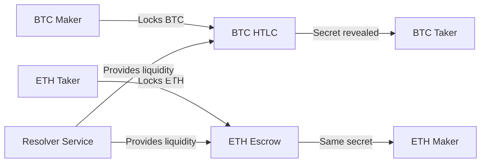

# Thunder Portal Testnet Wallets

Generated: 2025-08-02T08:47:18.149Z

## ⚡ Wallet Overview

This directory contains the wallet information for Thunder Portal's cross-chain atomic swap testing between Bitcoin testnet3 and Ethereum Sepolia.

## 📊 Wallet Addresses (Public Information)

### Bitcoin Testnet3 Wallets

| Wallet Type | Address | Funding Required | Purpose |
|------------|---------|------------------|---------|
| **Maker** | `tb1qthmpa24ghlyfcx654ahr65we2fry285jmxnd87` | 0.1-1 BTC | User sending BTC in swap |
| **Resolver Service** | `tb1qh3kya4ejyypt8e29kz2v6jfzxw9mxwuvv8xdut` | 1-5 BTC | Liquidity provider |
| **Taker** | `tb1qavrzvqd36gumpe42dm6nsjfphmefs0appcufya` | None | User receiving BTC |
| **HTLC Escrow** | *Generated per swap* | N/A | P2WSH script address |

### Ethereum Sepolia Wallets

| Wallet Type | Address | Funding Required | Purpose |
|------------|---------|------------------|---------|
| **Maker** | `0x36c147F1C7CC81a53DE10F190bac157988c5A175` | 0.1 ETH | User receiving ETH (gas only) |
| **Resolver Service** | `0xF79e5800150C8DFB3730C9Da17a157dD9D53E6db` | 5-10 ETH | Liquidity provider & deployer |
| **Taker** | `0x4cDe35b45BE7E9982c51B5c2F44b79d0078D85BE` | 1-5 ETH | User sending ETH |
| **Escrow Contract** | *Deployed by factory* | N/A | Smart contract address |

## 🔄 Swap Flow Architecture



## 💰 Funding Instructions

### Total Required Funds
- **Bitcoin testnet3**: ~6-11 BTC total
- **Ethereum Sepolia**: ~6.6-15.6 ETH total

### Testnet Faucets

#### Bitcoin Testnet3 Faucets
1. [CoinFaucet.eu](https://coinfaucet.eu/en/btc-testnet/) - 0.01 BTC per request
2. [Bitcoin Faucet UO1](https://bitcoinfaucet.uo1.net/) - 0.002 BTC per request
3. [Testnet Faucet](https://testnet-faucet.com/btc-testnet/) - Variable amounts

#### Ethereum Sepolia Faucets
1. [Sepolia Faucet](https://sepoliafaucet.com/) - 0.5 ETH daily
2. [Sepolia Dev Faucet](https://faucet.sepolia.dev/) - 0.5 ETH per request
3. [PK910 Faucet](https://sepolia-faucet.pk910.de/) - PoW-based faucet

## 🔐 Security Notes

1. **Private Keys**: Stored in `wallets-sensitive.json` and `.env.testnet` (DO NOT COMMIT)
2. **Mnemonics**: BIP39 24-word seed phrases for each wallet
3. **Derivation Paths**:
   - Bitcoin: `m/84'/1'/0'/0/0` (BIP84 testnet P2WPKH)
   - Ethereum: `m/44'/60'/0'/0/0` (BIP44 standard)

## 🛠️ Configuration

### Environment Variables
Copy `.env.testnet` to your service directories and update:
- `BTC_TESTNET_RPC`: Your Bitcoin testnet3 RPC endpoint
- `ETH_SEPOLIA_RPC`: Your Ethereum Sepolia RPC endpoint (e.g., Infura)

### Service Configuration
1. **Bitcoin HTLC Service**: Configure with resolver wallet credentials
2. **Relayer Service**: Configure with Ethereum resolver wallet
3. **Resolver Service**: Configure with both Bitcoin and Ethereum wallets

## 📋 Testing Checklist

- [ ] Fund Bitcoin maker wallet (0.1-1 BTC)
- [ ] Fund Bitcoin resolver wallet (1-5 BTC)
- [ ] Fund Ethereum maker wallet (0.1 ETH for gas)
- [ ] Fund Ethereum resolver wallet (5-10 ETH)
- [ ] Fund Ethereum taker wallet (1-5 ETH)
- [ ] Configure RPC endpoints in `.env.testnet`
- [ ] Deploy smart contracts to Sepolia
- [ ] Test end-to-end swap flow

## 🚀 Quick Start

```bash
# 1. Copy environment variables
cp doc/testnet-wallets/.env.testnet .env

# 2. Update RPC endpoints in .env
# Add your Infura/Alchemy API keys

# 3. Run testnet swap
make swap-testnet
```

## ⚠️ Important Reminders

1. These are TESTNET wallets - never use for mainnet
2. Keep private keys and mnemonics secure
3. Regularly check wallet balances before demos
4. Monitor testnet network status for reliability
5. Have backup RPC endpoints configured