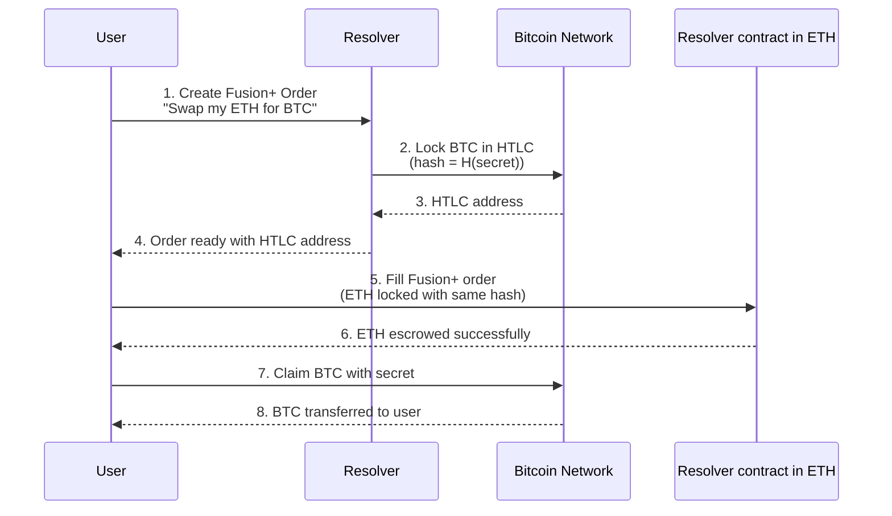
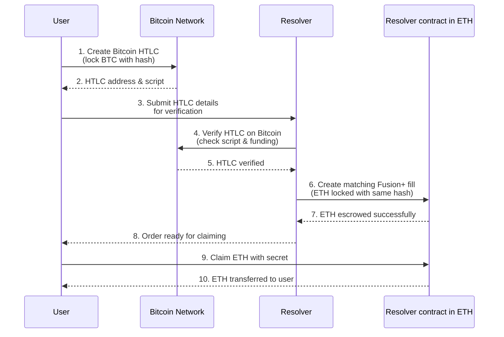

# Thunder Portal Flow Integration Summary

## 🎯 Goal: Native Bitcoin ↔ Ethereum Swaps Without Wrapping

Thunder Portal enables trustless atomic swaps between native Bitcoin and Ethereum networks, bringing Bitcoin's $800B market cap into DeFi without custody risk.

## 🔄 Integration Flow Architecture

### ETH → BTC Swap Flow

### BTC → ETH Swap Flow

## 🏗️ Key Components

### Thunder Portal API (Rust Backend)
- **HTLC Management**: Generate scripts, build transactions (fund/claim/refund)
- **Order Tracking**: SQLite database for swap state management
- **Bitcoin Integration**: Transaction verification and monitoring
- **API Endpoints**:
  - `POST /v1/orders` - Create swap order
  - `POST /v1/htlc/verify` - Verify Bitcoin HTLC
  - `GET /v1/transactions/{txId}/status` - Track transaction
  - `POST /v1/fusion/proof` - Submit Fusion+ execution proof

### 1inch Fusion+ Integration
- **No Custom Contracts**: Uses existing EscrowSrc/EscrowDst infrastructure
- **Resolver Logic**: Coordinates atomic execution across chains
- **Secret Management**: Ensures atomic reveal across both chains
- **Built-in HTLC**: Leverages Fusion+'s native hash-lock capabilities

## 🔐 Security Features

1. **Timeout Hierarchy**: Bitcoin timeout (48h) > Ethereum timeout (24h)
   - Prevents race conditions
   - Ensures resolver can always claim after user

2. **Atomic Execution**: 
   - Same secret hash on both chains
   - All-or-nothing guarantee
   - No custody risk

3. **Refund Protection**:
   - Automatic refunds after timeout
   - No funds can be locked forever

## 💡 Innovation: HTLC-as-a-Service

Instead of just building a resolver, Thunder Portal provides:
- **Abstract Complexity**: Simple API hides Bitcoin script details
- **Reusable Service**: Other resolvers can integrate easily
- **Multi-Chain Ready**: Architecture supports adding more chains
- **Professional Tools**: Webhook notifications, status tracking, error handling

## 🚀 Current Status

✅ **Fully Implemented**:
- Complete Rust backend with all API endpoints
- Bitcoin HTLC script generation and verification
- Transaction building and monitoring
- SQLite database with order tracking
- Docker support and testing infrastructure
- Comprehensive documentation

## 🎯 Value Proposition

1. **For Bitcoin Holders**: Access DeFi without wrapping BTC
2. **For Ethereum Users**: Direct access to Bitcoin liquidity
3. **For Resolvers**: New arbitrage opportunities
4. **For 1inch**: First DEX with native Bitcoin support

